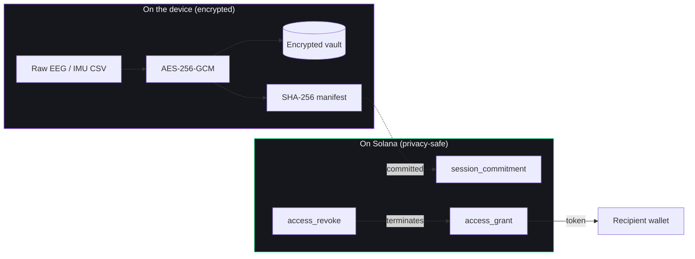

# HealthLog Protocol — Pitch Deck

13 slides, ~14s each (≈3:00 total spoken time, which is the Colosseum cap). Designed for a live competition where the audience is reading on a screen behind you while you talk. The added market / business / proof / advisor slides (9–12) are what convert a "cool demo" into a fundable company.

**Color system for every slide:** background `#0E0E11`, text `#F5F5F7`, accent gradient `#9945FF → #14F195` (Solana). Use Inter or Space Grotesk. Single brand mark in the bottom-right corner of every slide except 1 and 10.

Tooling: build in Figma, Slides (Google), Pitch.com, or Marp. Each slide spec below has **headline**, **body**, and **visual** sections — paste these into the deck tool and apply the color system.

---

## Slide 1 — Cover (15s)

**Headline:** HealthLog Protocol

**Sub:** Crypto-native consent and provenance for wearable health data.

**Visual:** Centered HL wordmark in the gradient. Below it: a faint EEG waveform (SVG, 30% opacity) crossing the lower third of the slide. Bottom-left: presenter name. Bottom-right: "Solana Frontier Hackathon · 2026."

**Asset to make:** Wordmark + EEG line. Generate the EEG line in Figma with a single SVG path or grab a free brain-wave SVG from undraw.co and tint it.

---

## Slide 2 — Problem (15s)

**Headline:** Wearable data has no consent layer.

**Body (3 bullets, large type, no commas):**
- Your data is fragmented across Muse, Oura, Whoop, Apple.
- AI is getting better at reading it.
- Permission lives in unreadable ToS pages — not on a chain.

**Visual:** Grid of 6 wearable logos in greyscale (Muse, Oura, Whoop, Apple Watch, Garmin, Fitbit) trapped behind a faint padlock icon. The point: data is locked and siloed. Use any open-license logo set; if you can't find one, just write the brand names in styled chips.

---

## Slide 3 — Solution (15s)

**Headline:** Your data on your phone. Your consent on Solana.

**Body:** HealthLog Protocol is a mobile app where wearable data stays encrypted on the device, and Solana records who you let touch it — with revocation, scope, and on-chain audit.

**Visual:** Two-column split. Left column: phone mockup with the dashboard screenshot, a lock icon overlay. Right column: a stylized Solana logo with three small chips around it labeled "Commit · Grant · Revoke." Arrow between columns labeled "manifest hash only."

**Asset:** mockuphone.com phone frame with `_screenshot_dashboard.png` dropped in. Solana mark from solana.com/branding.

---

## Slide 4 — Architecture (20s)

**Headline:** What's on-chain and what isn't.

**Visual:** Mermaid diagram (rendered as PNG via mermaid.live and exported). Single most important slide of the deck — read it from far away.



**Footer line:** "Raw health data never touches the chain."

**Render tip:** Paste the Mermaid into https://mermaid.live, set theme to dark, export as PNG at 2x.

---

## Slide 5 — Demo (20s)

**Headline:** Eight steps. End-to-end on devnet.

**Visual:** Horizontal pill row of the 8 steps with arrows and a glowing gradient highlight on the current step. Same component as the in-app Demo Flow card.

```
Import → Encrypt → Hash → Commit → Summarize → Grant → Verify → Revoke
```

Below it: a 3-up screenshot strip — Dashboard, SessionDetail (Commit screen with explorer link), Verifier (green checks). Phone mockups.

**Visual asset:** Three real screenshots in Galaxy S9 mockups, side by side, with the Solana mark in the gutter between them.

---

## Slide 6 — On-chain proof (15s)

**Headline:** Real transactions, not mocks.

**Visual:** Screenshot of an actual Solana Explorer page (`https://explorer.solana.com/tx/<sig>?cluster=devnet`) for one of your `commit` transactions. Annotate with a callout arrow pointing to the memo payload showing `{type: "session_commitment", manifestHash: "...", ...}`.

**Body:** Three real transaction signatures from devnet (captured 2026-05-08 from wallet `BrKt8mtkQdNno34YJYttxQXVHtNUYEcYQPP78wsjut2y`), each clickable in the live deck:

- `commit:` `3b8JsC6BUdsWrAYyV2SfexK4NaUEnvJh9b81to52rHD7KgwCBvfhv6TuoyABd6xKdyVzQ5MgeGpKJQ8tYt5DdKBS`
  → https://explorer.solana.com/tx/3b8JsC6BUdsWrAYyV2SfexK4NaUEnvJh9b81to52rHD7KgwCBvfhv6TuoyABd6xKdyVzQ5MgeGpKJQ8tYt5DdKBS?cluster=devnet
- `grant:`  `4w4DDVo96ToCKnzhAJiDEFXzggcc76Fh5SQsqeGBG8rUHVAez485or2zb3iMuahBvF1cCDu1NxfeGwNczA9RDNko`
  → https://explorer.solana.com/tx/4w4DDVo96ToCKnzhAJiDEFXzggcc76Fh5SQsqeGBG8rUHVAez485or2zb3iMuahBvF1cCDu1NxfeGwNczA9RDNko?cluster=devnet
- `revoke:` `LFu7qHkF7ssZoRkFc2fEKtfFaD3KBb4B1puP5e8AkS9i5EkXzcS13uiSYoa8VRw5FWxBEHo92t7VaF234iBfFAG`
  → https://explorer.solana.com/tx/LFu7qHkF7ssZoRkFc2fEKtfFaD3KBb4B1puP5e8AkS9i5EkXzcS13uiSYoa8VRw5FWxBEHo92t7VaF234iBfFAG?cluster=devnet

QR-code each link in the deck so a judge can scan straight from the slide.

**This slide is your single biggest differentiator vs. the average submission. Spend the time to make the screenshot crisp.**

---

## Slide 7 — Data Access Token (15s)

**Headline:** Permission, not data.

**Body:** A `DataAccessToken` is a non-transferable receipt that says: *recipient X can see scope Y of session Z until time T*. Revocable on-chain. Verifiable without revealing the data.

**Visual:** Mockup of the in-app token card — QR code on the left, scope chips on the right (`AI Summary Only` ✓ in teal, `Raw EEG` ✗ in red), expiry, big "Revoke on-chain" button. Gradient border.

**Asset:** Build this card in Figma (5 min). The token-card mockup also doubles as the in-app component you'd build day 2.

---

## Slide 8 — Market and wedge (20s)

**Headline:** MuseLog first. Then every wearable.

**Body (two bullets):**
- **Wedge:** MuseLog is already used by neuro researchers and consumers. They export raw EEG and have nowhere good to put it.
- **Expansion:** Oura, Whoop, Apple Health, Ray-Ban Meta — every wearable becomes a HealthLog-attached source. The protocol stays the same.

**Visual:** A horizontal arrow timeline. Left: MuseLog logo (you own this). Middle: Oura, Whoop, Apple Health logos (greyed, "next"). Right: Ray-Ban Meta, Garmin, etc. (further out, "horizon"). Above the timeline: "1 protocol, N adapters."

---

## Slide 9 — Market: TAM / SAM / SOM (15s)

**Headline:** A $200B market. A $25B wedge. We're underwriting both.

**Visual:** Three concentric circles on the left (TAM outer = teal stroke, SAM middle = purple stroke, SOM inner = solid gradient). Numbers blown up huge on the right.

| Layer | Size | What it is |
| --- | --- | --- |
| **TAM** | **$200B by 2030** | Global wearable-tech hardware ($186B by 2030, Grand View Research) + healthcare-AI software ($188B by 2030, Precedence Research). HealthLog sits at the intersection: the consent + audit layer every wearable AI needs. |
| **SAM** | **$25B** | ~250M premium wearable users worldwide (Apple Watch, Oura, Whoop, Garmin, Muse) × AI-insight subscriptions, **plus** the rapidly forming B2B market for legally-licensed wearable-derived health datasets used in research, biotech, longevity, and insurance underwriting. |
| **SOM** | **$80M ARR by 2031** | Capture **0.3%** of SAM via the MuseLog wedge (existing users, EEG-export pain), then 3 more wearable adapters: 500K paying consumers ($30M ARR) + 25 enterprise data-licensing deals ($50M ARR). |

**Footer line:** "Sources: Grand View Research (wearable tech, 2030); Precedence Research (healthcare AI, 2030); IDC wearable shipment data."

---

## Slide 10 — Business model (15s)

**Headline:** Two revenue engines today. Hardware tomorrow.

**Visual:** Three vertical columns under one shared brand bar at top.

**Column 1 — B2C Subscription**
$8/month for AI-powered personal health insights drawn from the user's *own* wearable data. The consent + audit + verifier layer is **free forever** — that's the moat.

**Column 2 — B2B Consented Data Marketplace**
Research labs, biotech, longevity clinics, and insurers pay HealthLog for *aggregated, scope-limited, fully-consented* wearable-derived datasets. Every record is opt-in via a Solana Data Access Token. Users earn revenue-share or HEALTH token rewards. We **never** resell raw data — only consented, scope-bound access. This is the engine that turns 50M users into a $50M+ ARR business without selling people out.

**Column 3 — B2C Hardware (post-Series A)**
Next-generation brain-sensing wearable, built on the protocol with our advisor's IP lineage (see slide 12). Hardware margin + protocol lock-in.

**Footer line:** "Every dollar flows through on-chain consent. The user is the customer — never the product."

---

## Slide 11 — Why now (15s)

**Headline:** Consumers are done being the product.

**Body (4 stat cards in 2×2 grid, giant numbers, small source text):**
- **$17M+** in FTC fines against Flo, GoodRx, and BetterHelp in 2023 alone for sharing health data without consent.
- **7M genetic profiles** leaked from 23andMe in late 2023; stock down ~95% since IPO. The market punished the breach in real time.
- **81%** of Americans say the risks of corporate data collection outweigh the benefits *(Pew Research, 2023)*.
- **~500M wearables** shipped per year and growing *(IDC)* — every device a future HealthLog source.

**Closing line:** "The market is asking for HealthLog. We're shipping it on Solana, today, on devnet."

---

## Slide 12 — Team & advisor (15s)

**Headline:** Built by neuro-hackers. Mentored by the Father of Wearable Computing.

**Body (two-up portrait layout):**

**Left — Founder: [Your name]**
Built MuseLog (N researchers, N CSV exports). Shipping HealthLog Protocol full-time. Domain credibility on the exact wedge.

**Right — Advisor: Prof. Steve Mann**
Father of Wearable Computing (MIT Media Lab; Professor, ECE, University of Toronto). Co-founder of InteraXon — the company that built the **Muse** brain-sensing headband. Inventor of the EyeTap, HDR imaging, and the field of "humanistic intelligence." 40+ years pioneering body-worn computing.

*If/when you add a cofounder or hire, a third smaller portrait fits below.*

**Visual:** Two large square portraits, gradient frame around each. Logo strip below: MuseLog · MIT Media Lab · University of Toronto · InteraXon (Muse).

**Closing line:** "Nobody else has the credibility *and* the wedge to build this layer."

---

## Slide 13 — Close + ask (10s)

**Headline:** HealthLog Protocol

**Body:** Your wearable data. Your consent. On Solana. The user is the customer.

**Visual:** Same as cover but with a row of links at the bottom (small text, all on one line):
`github.com/Libritor/HealthLog · Loom: <demo-url> · explorer.solana.com/tx/3b8JsC6BUdsWrAYyV2SfexK4NaUEnvJh9b81to52rHD7KgwCBvfhv6TuoyABd6xKdyVzQ5MgeGpKJQ8tYt5DdKBS?cluster=devnet`

Below: "Frontier Hackathon · Submission #_____"

---

## Pitch script — 2:30 (paired to slides above)

> [Slide 1 — Cover, 0:00–0:10]
> Today every wearable company is your data landlord. They decide what AI sees, what researchers see, even what *you* see. HealthLog Protocol flips it.

> [Slide 2 — Problem, 0:10–0:25]
> Wearable health data is fragmented across six different apps. AI is getting better at reading it every month. And the permission to share it lives in ToS pages nobody reads — not on a chain anybody can audit.

> [Slide 3 — Solution, 0:25–0:40]
> HealthLog Protocol is one mobile app where your wearable data stays encrypted on your phone, and Solana records who you let touch it. We tokenize permission to access health data — never the data itself.

> [Slide 4 — Architecture, 0:40–1:00]
> Here's the rule. Raw EEG, IMU, biometrics — encrypted, on the device, never on chain. The chain holds three things: a manifest hash that commits the session, an access grant that says who you let in and what scope, and a revoke that terminates it. That's the whole protocol.

> [Slide 5 — Demo, 1:00–1:20]
> Eight steps, end-to-end on devnet. Import a MuseLog session — that's brain data from a Muse 2 EEG headband. Encrypt it locally with AES-256-GCM. Hash it. Commit the hash to Solana via the memo program. Generate a scope-gated AI summary. Grant access to a recipient wallet — they get a Data Access Token, not the data. Verify. Revoke.

> [Slide 6 — Proof, 1:20–1:35]
> These are real transaction signatures on Solana devnet. The commit, the grant, the revoke. You can click them right now and see the memo payload — manifest hash, owner wallet, scope code. The raw EEG never left my phone.

> [Slide 7 — Token, 1:35–1:50]
> The Data Access Token is the artifact. It's non-transferable, scope-bounded, time-bounded, and revocable on-chain. The recipient can prove they have valid access without ever decrypting your raw data.

> [Slide 8 — Market, 1:50–2:10]
> We're starting with MuseLog because I built it — researchers and neuro-hackers already use it, and they have nowhere good to put their EEG. From there, every wearable becomes a HealthLog-attached source. One protocol. N adapters. The TAM is the entire wearable health market — sixty billion dollars and growing every quarter.

> [Slide 9 — Market TAM/SAM/SOM, 2:10–2:25]
> The market we're underwriting is two hundred billion dollars by 2030 — wearable hardware plus healthcare AI. Twenty-five billion is serviceable: every premium wearable user plus the B2B market for *legally consented* health data. We're going after eighty million ARR in five years through MuseLog plus three more wearable adapters.

> [Slide 10 — Business model, 2:25–2:40]
> Two engines, today. B2C: eight dollars a month for AI insights from your *own* data; the consent layer is free forever. B2B: research labs, biotech, and longevity clinics pay us for aggregated, scope-limited, fully consented wearable data. Users opt in per-token and earn revenue share. We never resell raw data. Hardware comes after Series A.

> [Slide 11 — Why now, 2:40–2:55]
> The market is asking for this. Seventeen million in FTC fines against Flo, GoodRx, and BetterHelp last year. Seven million genetic profiles leaked from 23andMe. Eighty-one percent of Americans say corporate data collection isn't worth it. Five hundred million wearables ship every year. Every one is a future HealthLog source.

> [Slide 12 — Team & advisor, 2:55–3:10]
> I'm [Name]. I shipped MuseLog — that's why I'm credible on this wedge. We're advised by Professor Steve Mann — the Father of Wearable Computing, co-founder of InteraXon, the company that built the Muse headband. Forty years of body-worn computing IP behind us.

> [Slide 13 — Close, 3:10–3:15]
> HealthLog Protocol. Your wearable data. Your consent. On Solana. The user is the customer. Thanks.

---

## Slide build order if you're rushed

If you only have an hour to build the deck, prioritize: **6 → 4 → 5 → 9 → 10 → 1 → 13 → 12 → 11 → 3 → 2 → 7 → 8.** Slide 6 (proof), 4 (architecture), 9 (market), and 10 (business model) are the slides that judges ask hardest about — make them rock-solid first.

## Tools

- Figma (free) for slide design and the token card mockup
- mermaid.live for the architecture diagram
- mockuphone.com for the phone mockups
- undraw.co for free SVG illustrations (brain, lock, security)
- solana.com/branding for the official Solana mark
- Pitch.com or Slides.com to present (both export to PDF for the submission)

## Submission package

When you submit on arena.colosseum.org, attach:

- **Loom URL** (the sub-3-min Colosseum video — see `PITCH_SCRIPT.md`).
- **Pitch deck PDF** (this slideshow, exported).
- **GitHub URL** of the public repo.
- **Three pinned devnet tx signatures** in the description.
- **Live demo URL** if you ship the Next.js landing page (recommended — single page is enough).
